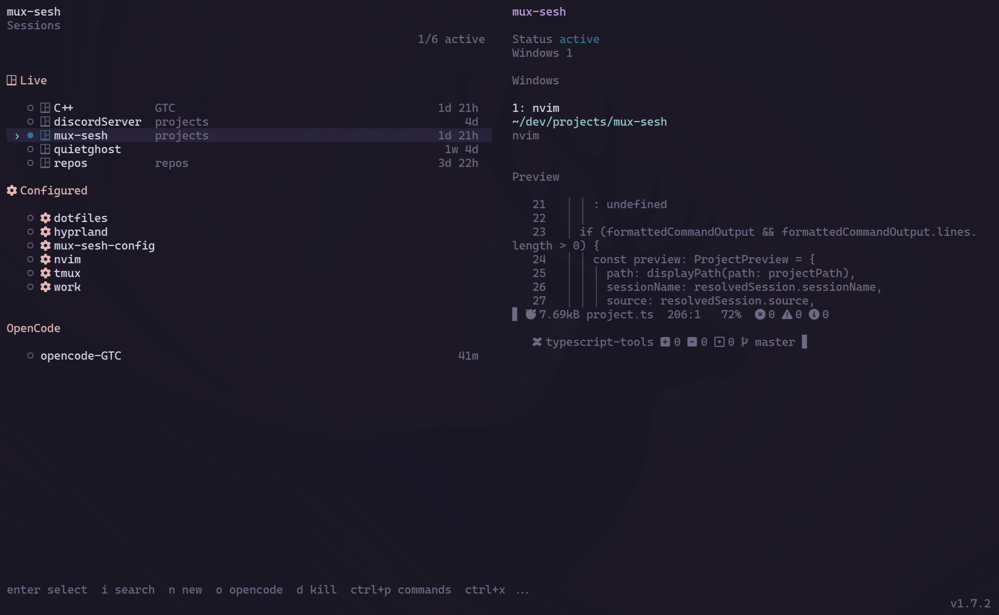

# mux-sesh

> A beautiful, fast tmux session manager built with OpenTUI and TypeScript

<p align="center">
  
</p>

## Features

- **Fuzzy search** - Find sessions and projects instantly
- **Lightning fast** - Built with Bun and OpenTUI
- **Beautiful UI** - Catppuccin-themed interface
- **Vim keybindings** - Navigate with j/k or arrow keys
- **Project scanning** - Browse and create sessions from local directories
- **Config-driven sessions** - Exact project rules, wildcard rules, and listed config targets
- **Session-aware project picker** - See when a project will attach to an existing tmux session vs create a new one
- **Rich previews** - Preview commands with directory fallback and live tmux context for running projects
- **GitHub integration** - Clone repos directly from URLs
- **Quick select** - Use number keys (1-9) for instant switching
- **Session management** - Create, switch, kill, and rename sessions

## Installation

### Prerequisites

- [Bun](https://bun.sh) - JavaScript runtime (required)
- [Zig](https://ziglang.org) - Required for building OpenTUI
- tmux - Terminal multiplexer
- git - For GitHub cloning feature

```bash
# Install Bun
curl -fsSL https://bun.sh/install | bash

# Install Zig (macOS)
brew install zig

# Install Zig (Linux - check https://ziglang.org/download/)
```

### Install from npm/Bun

```bash
bun install -g mux-sesh

# Then run
mux-sesh
```

### Install from Source

```bash
git clone https://github.com/quiet-ghost/mux-sesh.git
cd mux-sesh
git checkout opentui-convert

# Install dependencies
bun install

# Build standalone executable
bun run build

# Install globally
sudo cp dist/mux-sesh /usr/local/bin/
# or
cp dist/mux-sesh ~/.local/bin/
```

## Keybindings

### Normal Mode

| Key                    | Action                                          |
| ---------------------- | ----------------------------------------------- |
| `j` / `k` or `↑` / `↓` | Navigate up/down                                |
| `1-9`                  | Quick select session/project                    |
| `Enter`                | Switch to session / Create from project         |
| `i`                    | Enter search mode                               |
| `n`                    | Create new session                              |
| `d`                    | Kill selected session                           |
| `r`                    | Rename selected session                         |
| `l`                    | Jump to previous tmux session                   |
| `g`                    | Open the git-root session for the selected item |
| `e`                    | Edit configured session target                  |
| `R`                    | Refresh list                                    |
| `s`                    | Switch to sessions view                         |
| `p`                    | Switch to projects view                         |
| `q` or `Esc`           | Quit                                            |

### Standard Mode

| Key       | Action                                          |
| --------- | ----------------------------------------------- |
| `↑` / `↓` | Navigate                                        |
| `Ctrl+I`  | Search                                          |
| `Ctrl+N`  | New session                                     |
| `Ctrl+D`  | Kill selected live session                      |
| `Ctrl+R`  | Rename selected live session                    |
| `Ctrl+L`  | Jump to previous tmux session                   |
| `Ctrl+G`  | Open the git-root session for the selected item |
| `Ctrl+E`  | Edit configured session target                  |
| `Ctrl+Q`  | Quit                                            |

In search/new/rename mode, standard mode also supports `Ctrl+X` prefix commands for refresh, rename, kill, root, and opencode actions.

### Search Mode

| Key            | Action                   |
| -------------- | ------------------------ |
| Type to search | Filter sessions/projects |
| `Enter`        | Select first result      |
| `↑` / `↓`      | Navigate results         |
| `Esc`          | Cancel search            |

### New Session Mode

| Key               | Action                   |
| ----------------- | ------------------------ |
| Type project name | Filter projects          |
| Paste GitHub URL  | Clone and create session |
| Type custom name  | Create named session     |
| `Enter`           | Confirm selection        |
| `Esc`             | Cancel                   |

## Configuration

Configuration is stored at `~/.config/mux-sesh/config.json`:

```json
{
  "project_paths": ["~/dev", "~/personal", "~/work", "~/projects"],
  "repos_path": "~/dev/repos",
  "editor": "nvim",
  "editor_cmd": "nvim -c \"lua vim.defer_fn(function() if pcall(require, 'telescope') then vim.cmd('Telescope find_files') end end, 100)\"",
  "keybind_mode": "vim",
  "sort_order": "zoxide-first",
  "zoxide_mode": "rank",
  "dir_length": 2,
  "hidden_sessions": ["scratch", "tmp*"],
  "icons": {
    "tmux": "",
    "configured": "",
    "project": "",
    "opencode": ""
  },
  "default_session": {
    "startup_command": "nvim",
    "preview_command": "eza --all {}"
  },
  "projects": [
    {
      "path": "~/.dotfiles/hypr/.config/hypr",
      "session_name": "hyprland",
      "listed": true,
      "icon": "",
      "startup_command": "nvim"
    }
  ],
  "wildcards": [
    {
      "pattern": "~/work/**",
      "startup_command": "bun run dev"
    }
  ]
}
```

### Configuration Options

- **`project_paths`** - Array of directories to scan for projects
- **`repos_path`** - Directory where GitHub repositories will be cloned
- **`editor`** - Default editor to use
- **`editor_cmd`** - Default startup command for new sessions unless overridden
- **`keybind_mode`** - `vim` or `standard`
- **`sort_order`** - Session/project ordering: `live-first`, `configured-first`, `zoxide-first`, or `alphabetical`
- **`zoxide_mode`** - `off`, `rank`, or `merge` for zoxide-aware project ordering
- **`dir_length`** - Number of path segments used when generating session names from git roots or project paths
- **`hidden_sessions`** - Glob patterns for live tmux sessions to hide from the list
- **`icons`** - Global icons for tmux, configured, project, and opencode rows
- **`default_session`** - Fallback startup and preview commands
- **`projects`** - Exact path rules with optional `session_name`, `startup_command`, `preview_command`, `listed`, and `icon`
- **`wildcards`** - Pattern-based defaults for matching projects

### Rule Resolution

When you select a project, mux-sesh resolves its behavior in this order:

1. Exact `projects[]` path match
2. First matching `wildcards[]` rule
3. `default_session`

Session names use the git root when available, then apply `dir_length` if you did not set an explicit `session_name`.

### Listed Sessions

Set `listed: true` on a project rule to keep that target visible in the Sessions view even when tmux has not started it yet. This works well for dotfiles, config folders, dashboards, and other “always useful” targets.

If a live tmux session already exists with the same title, the live session takes precedence.

### Sorting and Zoxide

- `zoxide_mode: off` - scan only
- `zoxide_mode: rank` - reorder discovered projects by zoxide score
- `zoxide_mode: merge` - include additional zoxide-ranked projects inside configured roots
- `sort_order: live-first` - live sessions before configured placeholders
- `sort_order: configured-first` - configured placeholders before live sessions
- `sort_order: zoxide-first` - preserve project discovery/zoxide ordering
- `sort_order: alphabetical` - alphabetical project and session ordering

### Preview Behavior

`preview_command` inherits from `default_session`, can be overridden per project rule, and supports `{}` interpolation for the selected path.

- if the preview command succeeds, mux-sesh renders its output in the detail panel
- if it fails or times out, mux-sesh falls back to a directory listing
- if a project already has a linked tmux session, the preview also includes live tmux window details

Example:

```json
{
  "default_session": {
    "preview_command": "eza --all {}"
  },
  "projects": [
    {
      "path": "~/dev/projects/mux-sesh",
      "preview_command": "git -C {} status --short"
    }
  ]
}
```

### tmux Integration

For the best experience, bind mux-sesh to a global tmux keybinding. Add this to your `~/.tmux.conf`:

```bash
# Open mux-sesh in a popup with Alt+w (no prefix required)
bind-key -n M-w popup -E -w 62% -h 70% "mux-sesh"
```

After adding the binding, reload your tmux config:

```bash
tmux source-file ~/.tmux.conf
```

Now you can press `Alt+w` from anywhere in tmux (including inside nvim) to launch mux-sesh.

**Alternative Integration:**

- **From Neovim**: Use [mux-manager](https://github.com/quiet-ghost/mux-manager) - a Telescope-based tmux session manager that integrates directly into Neovim
- **With prefix**: Use `bind-key f popup -E -w 80% -h 80% "mux-sesh"` if you prefer requiring the tmux prefix key first

## Usage Examples

### Quick Session Switching

```bash
# Open mux-sesh
mux-sesh

# Press 1-9 to instantly switch to that session
# Or use j/k to navigate and Enter to select
```

### Create Session from Project

```bash
mux-sesh

# Press 'n' for new session
# Type project name to filter
# Rows show whether they will attach to an existing tmux session or create a new one
# Press Enter to create or attach
```

### Jump to Root / Last / Edit Target

```bash
mux-sesh

# Select a project or session, then press 'g' to jump to its git-root session
# Press 'l' to jump to the most recent non-current tmux session
# Select a configured session and press 'e' to open its target in your editor
```

### Clone from GitHub

```bash
mux-sesh

# Press 'n' for new session
# Paste GitHub URL:
#   https://github.com/user/repo
#   or
#   git@github.com:user/repo.git
# Press Enter to clone and create session
```

### Search Existing Sessions

```bash
mux-sesh

# Press 'i' to search
# Type to filter sessions
# Press Enter to switch to first match
```

## Color Scheme

mux-sesh uses the beautiful [Catppuccin](https://github.com/catppuccin/catppuccin) color scheme with the following palette:

- **Primary**: `#f38ba8` (Pink)
- **Active**: `#a6e3a1` (Green)
- **Inactive**: `#6c7086` (Gray)
- **Border**: `#89b4fa` (Blue)
- **Key**: `#f9e2af` (Yellow)
- **Action**: `#cba6f7` (Mauve)

  **Cross-Platform** - Works on Linux, macOS, Windows

## Development

```bash
# Install dependencies
bun install

# Run in dev mode (with hot reload)
bun run dev

# Type check
bun run typecheck

# Build for production
bun run build
```

## Contributing

Contributions are welcome! Please feel free to submit a Pull Request.

1. Fork the repository
2. Create your feature branch (`git checkout -b feature/amazing-feature`)
3. Commit your changes (`git commit -m 'Add some amazing feature'`)
4. Push to the branch (`git push origin feature/amazing-feature`)
5. Open a Pull Request

## License

MIT License - see [LICENSE](./LICENSE) for details.

## Acknowledgments

- Inspired by [ThePrimeagen's tmux-sessionizer](https://github.com/ThePrimeagen/.dotfiles/blob/master/bin/.local/scripts/tmux-sessionizer)
- Built with [OpenTUI](https://github.com/anomalyco/opentui)
- UI design inspired by [nvim telescope plugin](https://github.com/nvim-telescope/telescope.nvim)

## Related Projects

- [mux-manager](https://github.com/quiet-ghost/mux-manager) - Telescope-based tmux session manager for Neovim

---

<p align="center">
  Made with using <a href="https://github.com/anomalyco/opentui">OpenTUI</a> and <a href="https://bun.sh">Bun</a>
</p>
