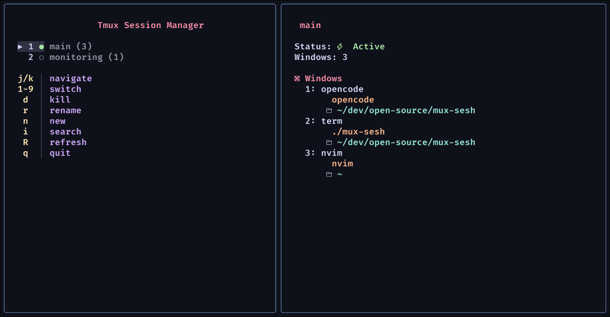

# Mux-Sesh

A beautiful, fzf-like tmux session manager with GitHub repository cloning support. Inspired by nvim telescope plugin aesthetics.



## Features

- 🎨 **Clean UI** - Minimal design inspired by nvim telescope
- 🔍 **Fuzzy Search** - fzf-like filtering with real-time results
- 📁 **Project Management** - Browse and create sessions from configurable project paths
- 🐙 **GitHub Integration** - Clone repositories directly from GitHub URLs
- ⚡ **Fast Navigation** - Keyboard shortcuts for quick session switching
- 🎯 **Smart Highlighting** - Matched letters highlighted in bold
- 📋 **Session Preview** - See session details and window information
- ⚙️ **Configurable** - Customize project paths, repos location, and editor

## Installation

### Prerequisites

- Go 1.19 or later
- tmux
- git (for GitHub cloning)
- nvim (optional, for enhanced session creation)

### Install with Go (Recommended)

```bash
# Install latest version
go install github.com/quiet-ghost/mux-sesh@latest

# Install specific version
go install github.com/quiet-ghost/mux-sesh@v0.2.0
```

### Install from source

```bash
# Clone the repository
git clone https://github.com/quiet-ghost/mux-sesh.git
cd mux-sesh

# Build and install
go build -o mux-sesh main.go config.go
sudo mv mux-sesh /usr/local/bin/

# Or install to your local bin
mv mux-sesh ~/.local/bin/
```

### Quick install script

```bash
curl -sSL https://raw.githubusercontent.com/quiet-ghost/mux-sesh/master/install.sh | bash
```

## Updating

### Update with Go

```bash
# Update to latest version
go install github.com/quiet-ghost/mux-sesh@latest
```

### Update from source

```bash
cd /path/to/mux-sesh
git pull origin main
go build -o mux-sesh main.go config.go
sudo mv mux-sesh /usr/local/bin/  # or ~/.local/bin/
```

## Configuration

The sessionizer automatically creates a configuration file at `~/.config/mux-sesh/config.json` on first run with sensible defaults.

### Default Configuration

```json
{
  "project_paths": ["~/dev", "~/personal"],
  "repos_path": "~/dev/repos",
  "editor": "nvim",
  "editor_cmd": "nvim -c \"lua if pcall(require, 'telescope') then vim.cmd('Telescope find_files') end\""
}
```

### Configuration Options

- **`project_paths`**: Array of directories to search for projects
- **`repos_path`**: Directory where GitHub repositories will be cloned
- **`editor`**: Default editor to use
- **`editor_cmd`**: Command to run when opening editor (supports telescope integration)

### Customizing Configuration

Edit `~/.config/mux-sesh/config.json`:

```json
{
  "project_paths": ["~/dev", "~/personal", "~/work", "~/projects"],
  "repos_path": "~/code/repos",
  "editor": "code",
  "editor_cmd": "code ."
}
```

## Usage

### Basic Usage

```bash
# Start the sessionizer
mux-sesh

# Or add an alias to your shell config
alias tmp='mux-sesh'
```

### Key Bindings

#### Normal Mode

- `Enter` or `1-9`: Switch to selected session
- `n`: Create new session
- `d`: Kill session
- `r`: Rename session
- `i`: Search sessions
- `R`: Refresh
- `q`: Quit

#### Search/New Session Mode

- `Enter`: Select/create
- `↑/↓`: Navigate
- `Esc`: Cancel

### Creating Sessions

#### From Local Projects

1. Press `n` to enter new session mode
2. Type project name to filter
3. Press `Enter` to create session in project root

#### From GitHub URLs

1. Press `n` to enter new session mode
2. Paste GitHub URL (https or ssh):
   - `https://github.com/user/repo`
   - `git@github.com:user/repo.git`
3. Press `Enter` to clone to configured repos directory and create session

#### Custom Session

1. Press `n` to enter new session mode
2. Type custom session name
3. Press `Enter` to create session

## Shell Integration

Add to your shell config (`.zshrc`, `.bashrc`, etc.):

```bash
# Basic alias
alias tmp='mux-sesh'

# Keyboard shortcuts (zsh)
bindkey -s '^[s' 'mux-sesh\n'  # Alt+s
```

## Related Tools

For Neovim users, check out [mux-manager](https://github.com/quiet-ghost/mux-manager) - a Telescope-based tmux session manager that complements mux-sesh perfectly:

- **mux-sesh** - Standalone TUI for terminal-based session management
- **mux-manager** - Session management from within Neovim using Telescope
- **Shared workflow** - Both tools support GitHub repo cloning and use the same configuration concepts

Together they provide a complete tmux session management solution for both terminal and Neovim environments.

## Dependencies

This project uses:

- [Bubble Tea](https://github.com/charmbracelet/bubbletea) - TUI framework
- [Lip Gloss](https://github.com/charmbracelet/lipgloss) - Styling
- [Bubbles](https://github.com/charmbracelet/bubbles) - TUI components

## Contributing

1. Fork the repository
2. Create your feature branch (`git checkout -b feature/amazing-feature`)
3. Commit your changes (`git commit -m 'Add some amazing feature'`)
4. Push to the branch (`git push origin feature/amazing-feature`)
5. Open a Pull Request

## License

This project is licensed under the MIT License - see the [LICENSE](LICENSE) file for details.

## Acknowledgments

- Inspired by [ThePrimeagen's tmux-sessionizer](https://github.com/ThePrimeagen/.dotfiles/blob/master/bin/.local/scripts/tmux-sessionizer)
- UI design inspired by nvim telescope plugin
- Built with [Charm](https://charm.sh/) TUI libraries
